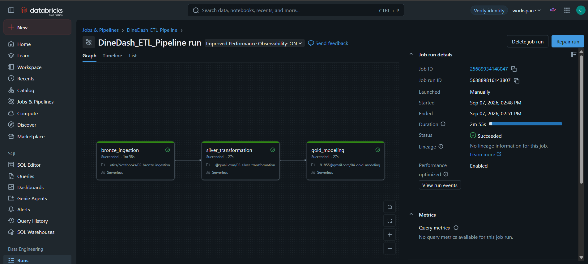

# DineDash — End-to-End Data Engineering & Power BI Analytics

DineDash is an end-to-end food delivery data engineering project built using Databricks and Spark SQL.

The project demonstrates how raw operational data can be transformed into a clean, analytics-ready data model using **Medallion Architecture**, followed by business intelligence and visualization using **Power BI**.

---

## 🚀 Project Overview

Food delivery platforms generate data across customers, restaurants, orders, menu items, delivery agents, and locations.

The objective of DineDash is to build a complete data pipeline that transforms raw food delivery data into structured analytical datasets ready for business reporting.

### Data Flow

**Raw Data → Bronze → Silver → Gold → Power BI**

The data engineering layer is implemented in Databricks, while Power BI is used as the planned analytics and visualization layer.

---

## 🏗️ Architecture

DineDash follows the **Medallion Architecture** pattern.

)

### Bronze Layer

The Bronze layer contains the ingested source data with minimal transformation.

Datasets:

- Customers
- Restaurants
- Delivery Agents
- Locations
- Menu Items
- Orders
- Order Items

### Silver Layer

The Silver layer contains cleaned and transformed data.

Key transformations include:

- Removing duplicate customer records
- Removing duplicate delivery agent records
- Removing invalid order records
- Converting timestamp fields to proper timestamp types
- Standardizing numeric data types
- Flattening nested order item data
- Preparing clean datasets for analytical modeling

### Gold Layer

The Gold layer contains an analytics-ready **star schema** consisting of fact and dimension tables.

**Dimension Tables**

- `dim_customer`
- `dim_restaurant`
- `dim_delivery_agent`
- `dim_location`
- `dim_menu_item`

**Fact Tables**

- `fact_orders`
- `fact_order_items`


---

## ⚙️ ETL Pipeline

The Bronze, Silver, and Gold layers are orchestrated through a Databricks Job.

### Pipeline

**Bronze Ingestion → Silver Transformation → Gold Modeling**



```text
Bronze Ingestion
       ↓
Silver Transformation
       ↓
Gold Modeling
